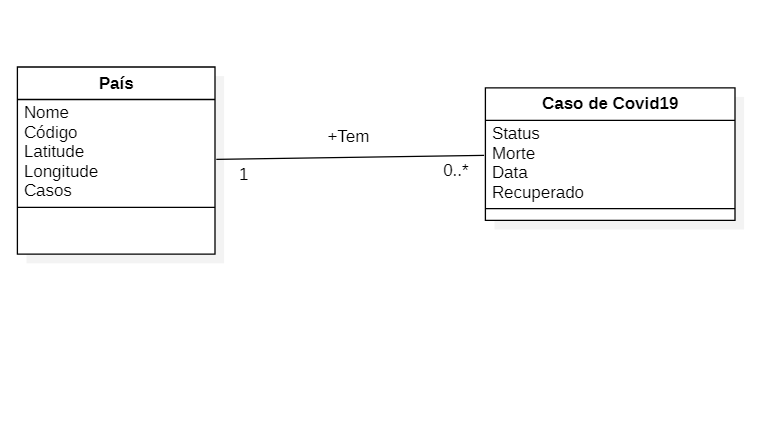

# Aluno
* Gustavo Mantellatto Elias

 

## Tarefa 1 sobre APIs de Acesso
[Link para o notebook](https://github.com/gustavopir/MC536/blob/main/lab01/notebook/lab01-api.ipynb)

## Tarefa 2 sobre Engenharia Reversa

